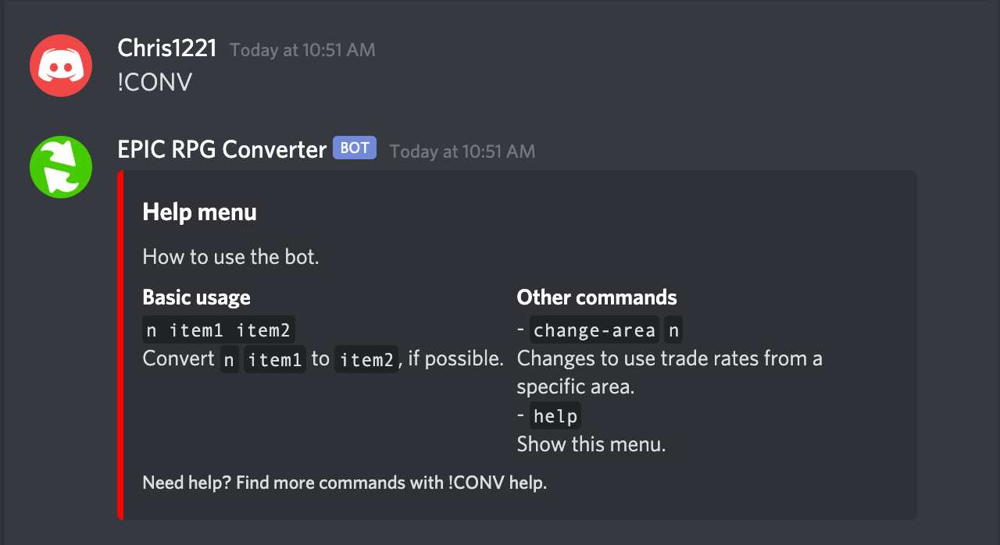
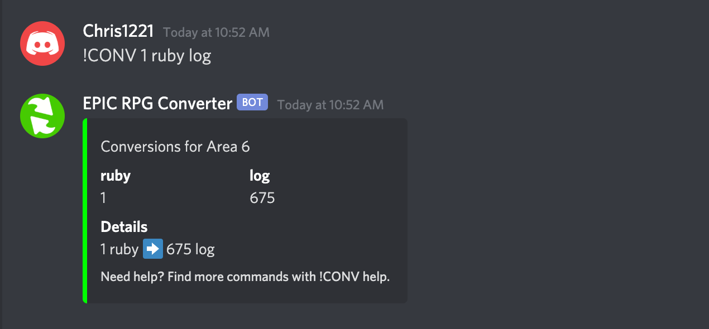
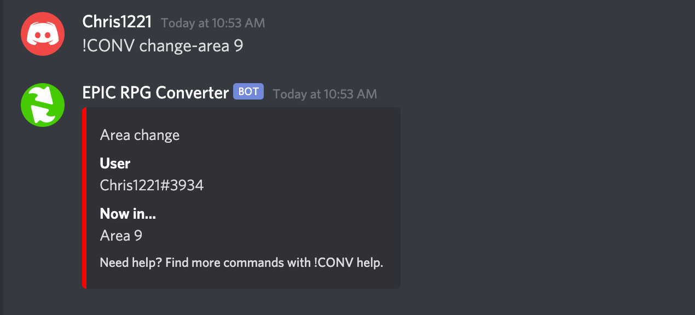

## Resource conversion bot for Epic RPG

This is a Discord bot which implements a simple shortest path graph-based conversion strategy between the many resources available in Epic RPG. It allows users to quickly switch areas as they progress through the game and intelligently alerts them to impossible trades (apples for logs in Area 1, for example). A user is automatically registered with the bot their first time using it, and information such as area preferences and usage statistics are persistently stored in a PostgreSQL database. 


[To invite the bot to your server, click here.](https://discord.com/api/oauth2/authorize?client_id=773260807638089768&permissions=8&scope=bot)

## Basic usage

The trigger for this bot is `!CONV`. Invoking the trigger with no additional arguments will bring up a help menu. You can also call `!CONV help` for the same menu.



### Converting between resources

To calculate the resulting number of `item2` possible from a certain number `n` of `item1`, the usage is:

```
!CONV n item1 item2
```

- `n` is an integer (whole number).
- `item1` is the item that you **have**.
- `item2` is the item that you **want**.

The bot will return both the largest possible number of `item2` that can be made from `item1`, as well as the conversion path that it used to get there.



### Moving between areas

When your character transitions to a new level, the bot will not automatically recognise this. You must update your area yourself. This ensures that the correct trade rates are used and that certain conversions are disallowed.

To change to area `n`: 

```
!CONV change-area n
```

The bot will recognise your user name and update your area in the PostgreSQL database.


